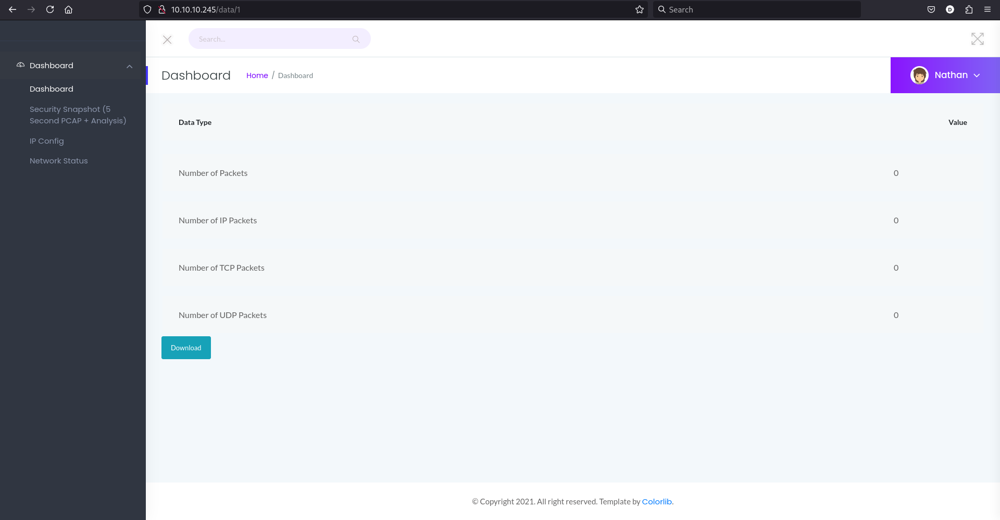

# Cap
**Cap** is a HackTheBox Linux machine serving a web app, relying on url-based indentification, allowing for trivial manipulation and extraction of an adjacent user's network traffic capture. Analysis of the traffic reveals valid SSH credentials. Enumeration of the user's environment leads us to a program with root-aquiring abilities which can be leveraged to escalate privileges to root.

## Enumerating ports
Fistly, I needed to know what I was working with - what services were running on the system.

I conducted 2 scans:
* quick - general port scan, find which ports are open;
* version - version and nmap default scripts scan for finding the version and base access I had on the services.

### Scanning - quick

```bash
(sz3kz@kali)~{tun0:10.10.14.19}~[Cap]$ sudo nmap -sS -T5 -oN quick-scan.txt $IP
Starting Nmap 7.95 ( https://nmap.org ) at 2025-01-25 14:47 EST
Nmap scan report for 10.10.10.245
Host is up (0.14s latency).
Not shown: 997 closed tcp ports (reset)
PORT   STATE SERVICE
21/tcp open  ftp
22/tcp open  ssh
80/tcp open  http

Nmap done: 1 IP address (1 host up) scanned in 3.70 seconds
```

As shown, the server is hosting ftp, ssh and an http service.

ASIDE: What I also deduced, is that the server is most probably not behind a firewall, in contrast to [Lame](https://github.com/sz3kz/cybersecurity-blog/tree/main/Lame).

### Scanning - version

```bash
(sz3kz@kali)~{tun0:10.10.14.19}~[Cap]$ sudo nmap -sS -sV -sC -p 21,22,80 -T5 -oN version-scan.txt $IP
Starting Nmap 7.95 ( https://nmap.org ) at 2025-01-25 14:50 EST
Nmap scan report for 10.10.10.245
Host is up (0.20s latency).

PORT   STATE SERVICE VERSION
21/tcp open  ftp     vsftpd 3.0.3
22/tcp open  ssh     OpenSSH 8.2p1 Ubuntu 4ubuntu0.2 (Ubuntu Linux; protocol 2.0)
| ssh-hostkey:
|   3072 fa:80:a9:b2:ca:3b:88:69:a4:28:9e:39:0d:27:d5:75 (RSA)
|   256 96:d8:f8:e3:e8:f7:71:36:c5:49:d5:9d:b6:a4:c9:0c (ECDSA)
|_  256 3f:d0:ff:91:eb:3b:f6:e1:9f:2e:8d:de:b3:de:b2:18 (ED25519)
80/tcp open  http    Gunicorn
|_http-server-header: gunicorn
|_http-title: Security Dashboard
Service Info: OSs: Unix, Linux; CPE: cpe:/o:linux:linux_kernel

Service detection performed. Please report any incorrect results at https://nmap.org/submit/ .
Nmap done: 1 IP address (1 host up) scanned in 12.43 seconds
```

From the scan I discovered versions of the services:
* `vsFTPd 3.0.3` is vulnerable to **CVE-2021-30047** - a remote DOS attack. This does not help in owning the system.
* While `OpenSSH 8.2p1` has a list of [vulnerabilities](https://nvd.nist.gov/vuln/search/results?cves=on&cpe_version=cpe:/a:openbsd:openssh:8.2p1), they typically already require access to the system or rely on an administrator connection to be occuring at the time of exploit. Keeping these in mind, I moved on.
* Did not find anything interesting about the `Gunicorn` http server.

## Enumerating FTP & SSH

### FTP
Normally, when anonymous access is allowed on a FTP server, nmap will detect that. In order to confirm disallowed anonymous access, I tried to manually connect to vsFTPd:

```bash
(sz3kz@kali)~{tun0:10.10.14.19}~[Cap]$ ftp anonymous@$IP
Connected to 10.10.10.245.
220 (vsFTPd 3.0.3)
331 Please specify the password.
Password:
530 Login incorrect.
ftp: Login failed
ftp> exit
221 Goodbye.
```

No anon access confirmed.

### SSH
I really had nothing to work with except maybe some brute-force attacks, so I decided to leave it.

## Enumerating HTTP
Let's check the http service now!

### Home page
After navigating to the home page, I was greeted with:


From the Dashboard alone I derived that the site has to do with network traffic analysis.

It is also important to note that we are already logged in as **Nathan**.

### Account options
Clicking at the _Nathan_ box revealed some basic account options:


These were - however - unclickable, probably due to not being implemented.

### Netstat & IP
I did not find anything of interest on these pages:


### Security dashboard
I then took a look at the security dashboard:



It appears that this webpage allows users to download a capture of their network traffic. I confirmed my suspicion by clicking on the Download box, which triggered a download to my system:

```bash
(sz3kz@kali)~{tun0:10.10.14.19}~[Cap]$ ls ~/DownloadOrCapture/
1.pcap
```

## Exploiting the URL
What caught my attention is the path in the page's URL:

```bash
http://10.10.10.245/data/1
```

What is that `1` at the end? None of the other pages had such a weird path. I wouldn't think anything of it if the other pages had something like `/data/2` and `/data/3`, but they don't. Apart from that, the page does not have any link that would maybe point to `/data/2` - indicating the `1` as the first part of many data pages I could access. 

I have then realized that the website might server contents of `/data/` to every user, entrusting the navigation controls to point the client to the file that meant for them. This could indicate an [Insecure Direct Object Reference](https://portswigger.net/web-security/access-control/idor) vulnerability, where by changing the URL I can view resources I was not supposed to.

I tried my hypothesis:

```bash
http://10.10.10.245/data/1 -> http://10.10.10.245/data/0
```


This allowed me to download network traffic of another user!

## Analysing the PCAP captured traffic in Wireshark
First things first after opening Wireshark, I wanted to have an overview of what traffic was captured:

`Statistics` -> `Protocol Hierarchy`


The pcap has http and ftp traffic.

### Analysing HTTP
I believed that HTTP data would disclose much more info than ftp, so I checked it first.


I wanted to get a neatly concatenated view of the conversation:
`Right-Click the packets` -> `Follow` -> `HTTP Stream`

```bash
GET / HTTP/1.1
Host: 192.168.196.16
User-Agent: Mozilla/5.0 (Windows NT 10.0; Win64; x64; rv:88.0) Gecko/20100101 Firefox/88.0
Accept: text/html,application/xhtml+xml,application/xml;q=0.9,image/webp,*/*;q=0.8
Accept-Language: en-GB,en;q=0.5
Accept-Encoding: gzip, deflate
Connection: keep-alive
Upgrade-Insecure-Requests: 1
DNT: 1
Sec-GPC: 1
Pragma: no-cache
Cache-Control: no-cache

HTTP/1.0 200 OK
Content-Type: text/html; charset=utf-8
Content-Length: 1240
Server: Werkzeug/2.0.0 Python/3.8.5
Date: Fri, 14 May 2021 13:12:49 GMT

<!doctype html>
<html lang="en">
        <head>
                <link href="https://cdn.jsdelivr.net/npm/bootstrap@5.0.1/dist/css/bootstrap.min.css" rel="stylesheet" integrity="sha384-+0n0xVW2eSR5OomGNYDnhzAbDsOXxcvSN1TPprVMTNDbiYZCxYbOOl7+AMvyTG2x" crossorigin="anonymous">
                <link href="https://bootswatch.com/5/darkly/bootstrap.css" rel="stylesheet">
                <link href="/static/main.css" rel="stylesheet">
        </head>

        <body class="text-center">
                <h1 class="h3 mb-3 font-weight-normal">Please Enter PCAP to be analyzed</h1>
                <form action="/upload" method="POST" enctype="multipart/form-data">

                        <label for="formFile" class="form-label">PCAP To Be Analzyed</label>
                        <input name="file" class="btn custom-form-cap form-control" type="file" id="formFile">
                        <input name="submit" type="submit" value="Submit">
                        <!--<button class="btn btn-lg btn-primary btn-block" type="submit">Submit</button>-->
                </form>

        </body>
        <footer>
                <p style="bottom: 0%; position: fixed; width: 100%;" class="mt-5 mb-3 text-muted">&copy; 2021</p>
        </footer>
        <script src="https://cdn.jsdelivr.net/npm/bootstrap@5.0.1/dist/js/bootstrap.bundle.min.js" integrity="sha384-gtEjrD/SeCtmISkJkNUaaKMoLD0//ElJ19smozuHV6z3Iehds+3Ulb9Bn9Plx0x4" crossorigin="anonymous"></script>
```
Disappointingly, the traffic only had a random `GET` request to a page, with no important information.
