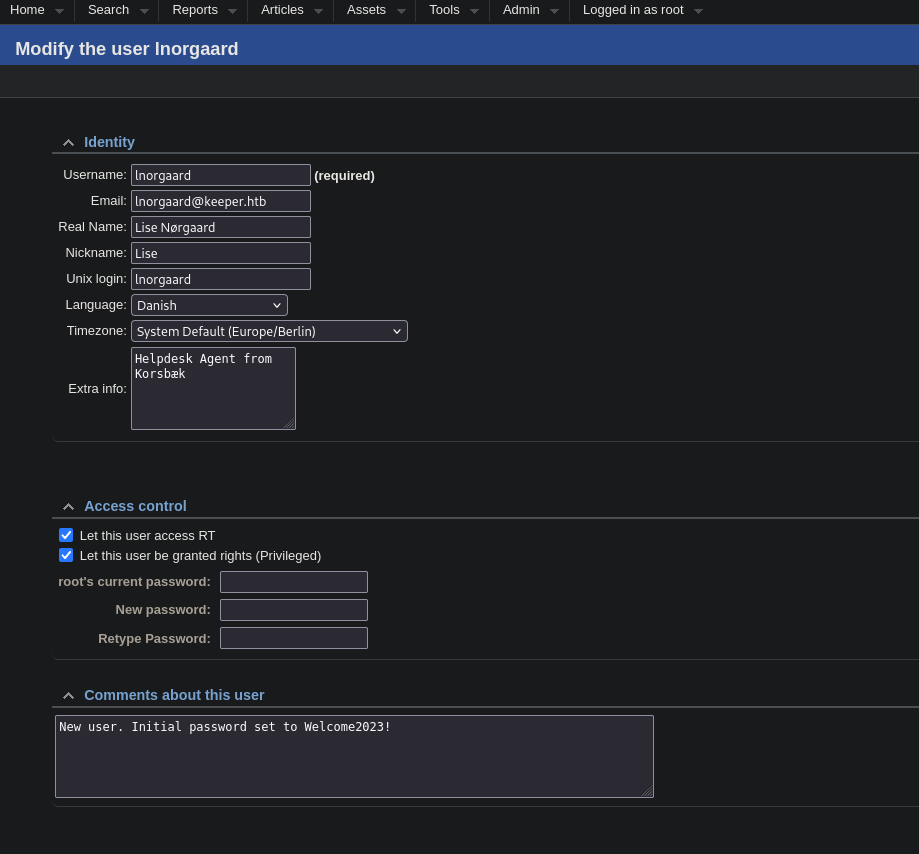

# Keeper
**Keeper** is an Easy HackTheBox machine. It hosts a ticket website set up without changing default credentials. After a bit of looking, ssh credentials for a normal user can be found. SSHing into the machine reveals a zip file containing a dump of a vulnerable KeePass application, allowing us to recover the key for the database. In the database the root's putty ssh key file, which after translating into OpenSSH format gives us root access to the machine.

## Enumerating ports
After making sure I can access the machine:

```bash
(sz3kz@kali)~{tun0:10.10.14.19}~[Keeper]$ IP="10.10.11.227"
(sz3kz@kali)~{tun0:10.10.14.19}~[Keeper]$ ping -c 5 $IP
PING 10.10.11.227 (10.10.11.227) 56(84) bytes of data.
64 bytes from 10.10.11.227: icmp_seq=1 ttl=63 time=163 ms
64 bytes from 10.10.11.227: icmp_seq=2 ttl=63 time=142 ms
64 bytes from 10.10.11.227: icmp_seq=3 ttl=63 time=374 ms
64 bytes from 10.10.11.227: icmp_seq=4 ttl=63 time=197 ms
64 bytes from 10.10.11.227: icmp_seq=5 ttl=63 time=264 ms

--- 10.10.11.227 ping statistics ---
5 packets transmitted, 5 received, 0% packet loss, time 4009ms
rtt min/avg/max/mdev = 142.216/227.800/373.661/83.746 ms
```

I conducted a quick scan of the machines ports and a deeper scan of the ports that were detected open.

The quick scan:

```bash
(sz3kz@kali)~{tun0:10.10.14.19}~[Keeper]$ sudo nmap -sS -T5 -O -oN quick-scan.txt $IP
Starting Nmap 7.95 ( https://nmap.org ) at 2025-02-05 15:48 EST
Nmap scan report for keeper.htb (10.10.11.227)
Host is up (0.11s latency).
Not shown: 998 closed tcp ports (reset)
PORT   STATE SERVICE
22/tcp open  ssh
80/tcp open  http
Device type: general purpose
Running: Linux 4.X|5.X
OS CPE: cpe:/o:linux:linux_kernel:4 cpe:/o:linux:linux_kernel:5
OS details: Linux 4.15 - 5.19
Network Distance: 2 hops

OS detection performed. Please report any incorrect results at https://nmap.org/submit/ .
Nmap done: 1 IP address (1 host up) scanned in 3.72 seconds
```

The deeper scan:

```bash
(sz3kz@kali)~{tun0:10.10.14.19}~[Keeper]$ sudo nmap -sV -sC -T5 -p 22,80 -oN version-scan.txt $IP
Starting Nmap 7.95 ( https://nmap.org ) at 2025-02-05 15:49 EST
Nmap scan report for keeper.htb (10.10.11.227)
Host is up (0.18s latency).

PORT   STATE SERVICE VERSION
22/tcp open  ssh     OpenSSH 8.9p1 Ubuntu 3ubuntu0.3 (Ubuntu Linux; protocol 2.0)
| ssh-hostkey:
|   256 35:39:d4:39:40:4b:1f:61:86:dd:7c:37:bb:4b:98:9e (ECDSA)
|_  256 1a:e9:72:be:8b:b1:05:d5:ef:fe:dd:80:d8:ef:c0:66 (ED25519)
80/tcp open  http    nginx 1.18.0 (Ubuntu)
|_http-title: Site doesn't have a title (text/html).
|_http-server-header: nginx/1.18.0 (Ubuntu)
Service Info: OS: Linux; CPE: cpe:/o:linux:linux_kernel

Service detection performed. Please report any incorrect results at https://nmap.org/submit/ .
Nmap done: 1 IP address (1 host up) scanned in 11.83 seconds
```

Summary of the scans:
* target OS -> Linux 4.15 - 5.19
* no firewall (closed tcp ports)
* 22 -> ssh
  * version not vulnerable
* 80 -> http
  * nginx/1.18
  * vulnerable to crashes -> not helpful for rooting

## Enumerating the website
Since I didn't have a lot of information about the system and SSH does not have any default credentials (ssh passwords are machine passwords), I really didn't have any leads on doing anything with SSH at the start. I decided to look into the website first in order to gather more info.

### Connecting
This is what I saw when navigating to the IP address over http:


After clicking the link my DNS lookup failed, leading to this:


Here I suspected that the site does something called virtual hosting.

Virtual hosting is the act of running multiple servers on the same machine(the same IP address) and deciding on which one to send to the client based on the "Host" header of the request.

Normally, this wouldn't be a problem if my machine was connected to a DNS server that would pre-map the machine ip address to the multiple http servers it hosts. I however do not have such a DNS to connect to. That means that my DNS is trying to get information on a public DNS, that does not have the entry of this hackthebox site, leading to nothing being found.

This means that I have to manually map my DNS configurations on my machine to tell my DNS to go straight to the ip address of the box.

Looking at the URL of the site the link points to, I see that I want to access `tickets.keeper.htb`

I `sudo vim` added the following entry to my `/etc/hosts` file:

```bash
10.10.11.227    tickets.keeper.htb
```

When I tried visiting the link again, I could finally access the resource:


### Taking advantage of default credentials
The login page reveals `tickets.keeper.htb` to be a Request Tracker service. Studying its version (`4.4.4`) I was not able to find any exploits.

However, [Request Tracker does have known default conditionals](https://rt-wiki.bestpractical.com/wiki/ManualBasicAdministration):

```bash
root:password
```

I tried this set of credentials and successfully logged in!


### User discovery
After poking around, I found a user account that is administrated by the service in `Admin` -> `Users`:



This pointed me the following credentials:

```bash
lnorgaard:Welcome2023!
```

I tried these credentials through ssh and successfully connected to the machine:

```bash
(sz3kz@kali)~{tun0:10.10.14.19}~[Keeper]$ ssh lnorgaard@10.10.11.227
lnorgaard@10.10.11.227's password:
Welcome to Ubuntu 22.04.3 LTS (GNU/Linux 5.15.0-78-generic x86_64)

 * Documentation:  https://help.ubuntu.com
 * Management:     https://landscape.canonical.com
 * Support:        https://ubuntu.com/advantage
Failed to connect to https://changelogs.ubuntu.com/meta-release-lts. Check your Internet connection or proxy settings

You have mail.
Last login: Sat Feb  8 14:11:10 2025 from 10.10.14.19
lnorgaard@keeper:~$
```

## Enumerating the user's environment

### Discovering a .zip file

After listing the home directory of `lnorgaard` I found a zip file:

```bash
lnorgaard@keeper:~$ ls
RT30000.zip  user.txt
```

Since `RT30000.zip` is not a default file one finds in a home directory, I decided to download it to my machine for further analysis.

### Downloading the .zip file
I started a python http server on the remote machine:

```bash
lnorgaard@keeper:~$ python3 -m http.server 1234
Serving HTTP on 0.0.0.0 port 1234 (http://0.0.0.0:1234/) ...

```

and `curl`ed the file into my box:

```bash
(sz3kz@kali)~{tun0:10.10.14.19}~[Keeper]$ curl http://${IP}:1234/RT30000.zip --output files.zip
  % Total    % Received % Xferd  Average Speed   Time    Time     Time  Current
                                 Dload  Upload   Total   Spent    Left  Speed
100 83.3M  100 83.3M    0     0   292k      0  0:04:52  0:04:52 --:--:--  269k
```
