# Lame

"Lame" is an easy machine hosted on HackTheBox. A Linux file-share server with outdated software, resulting in two known vulnerabilities, one of which being exploitable. Let's dive in!

## Server enumeration

After connecting to HackTheBox using the correct .ovpn file and starting the machine, I proceeded to ping the supplied IP address to make sure the server was live.

For convenience sake, I make a habit of assigning the ip address of the machine to a shell variable, that way I can use it without losing freedom of my clipboard.

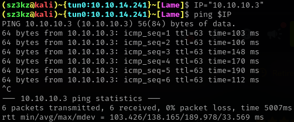

As we can see, the target is indeed live.

I did 2 scans:
 - A quick scan that quickly shows me how many and which ports are open on the machine;
 - A version scan, showing me each detail about a service that nmap could find.

### Quick scanning

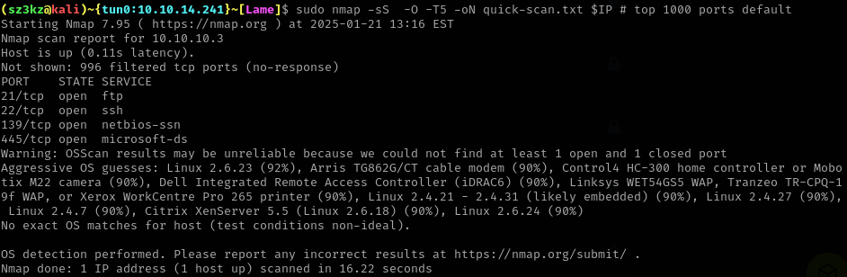

As we can see, there are 4 ports open on the machine. The ftp and ssh ports are self-explanatory. 

The other two - 139 and 445 - are ports characteristic of SMB over NetBIOS and SMB over TCP/IP, respectively. The most important thing is that there exist some SMB service on the machine too.

Although nmap couldn't identify what OS is running on the system, we can see that it is most probably some Linux distro.

NOTE: commonly glossed over, the fact that all other ports are labeled as "filtered" will become important later.

### Version Scanning

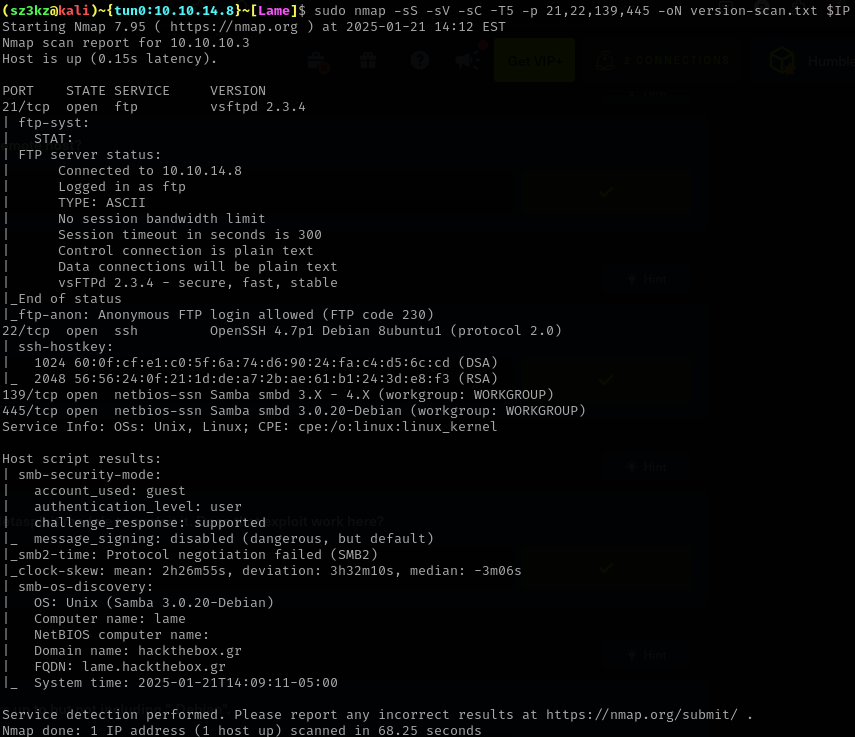

With a version scan utilizing version detection and allowing nmap to execute default scriots yields much more info about the services. We now know that the machine is running vsFTPd 2.3.4, as well as 3.0.20 Samba.

Having solved the box already, I know that the ssh service will be of no interest for me, so I'll focus on the ftp and samba services

## FTP exploitation

Instead of connecting to the ftp server and checking for downloadable files, let us first check if vsFTPd 2.3.4 is vulnerable to any exploit. 

After a google search we come across the [vsftpd backdoor exploit](https://metalkey.github.io/vsftpd-v234-backdoor-command-execution.html) this version is vulnerable to. 

From what I have read, the root of the vulnerability is a compromised source of distribution of vsFTPd software. Someone broke into an official server offering vsFTPd for download and - without being noticed - changed the version to contain a backdoor.

The fact being that the exploit is essentially a mod to the software makes it trivial to trigger. When a server detects a connection, which used a username of format "{any-string-you-want}:)", it will open up a listening shell on port 6200.

I triggered the backdoor:

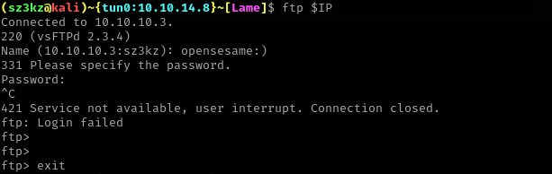

Now all that is left is to connect to the port and viola. Just to be sure we can scan the 6200 port with nmap to check if it's open...

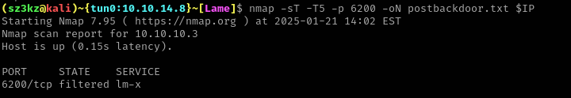

Oh shit. This is not good. Just like in the quick scan, any port other than the 4 we detected earlier is "filtered", meaning something (most likely a firewall) is blocking any connection that are meant for the ports. That means that even if the backdoor has been triggered, the firewall will not allow us to connect to it in the first place!

We can confirm we do not get a shell on 6200 by manually trying to connect:

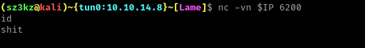

In contrast to the username payload we used to trigger the backdoor, this made me :( .

## SMB exploitation

Refusing to give up, I switched to finding more about the Samba service. Googling the version reveals [CVE 2007 2447](https://nvd.nist.gov/vuln/detail/CVE-2007-2447), a remote code execution vulnerability found in our Samba version.

While I was made aware to the fact that the [Metasploit](https://www.metasploit.com/) framework has a built in script for exploiting this CVE, I decided against using it. While I believe Metasploit makes it easier to run exploits, it does so at the cost of abstracting the living shit out of the exploitation process, and to me that essentially makes CTFs a waste of time.
TLDR: We gonna do it with google instead.

After some further searching, I have found [this site](https://amriunix.com/posts/cve-2007-2447-samba-usermap-script/) detailing the inner-workings of the vulnerability and providing a python script Proof-Of-Concept script.

In order to use the script, I needed to download it and setup my machine to use it.

### Downloading the exploit

First, I copied the github link to the repo;

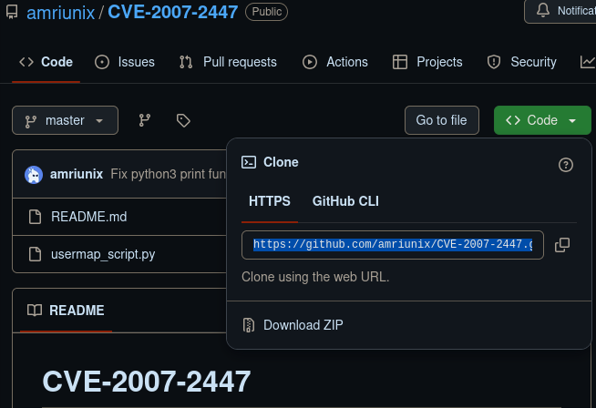

and cloned it to my local system.

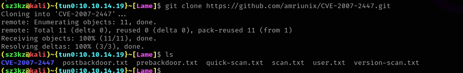

When I peaked inside the script to see the code, I noticed an external module import present

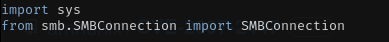

Since this module is not a built-in python module, I would have to download it in order to run.
Otherwise:

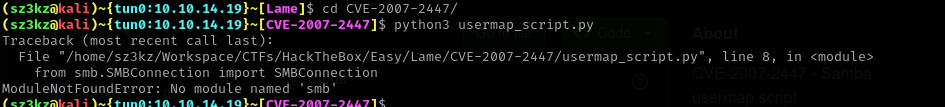

I however did not want to install the module system-wide. I believe it to be long before I have the use this exploit again, so I do not see the reason to keep the smb module on my machine after this CTF. I decided to create a python3 virtual environment.

### Python virtual environment setup

A python virtual environment is basically a directory, where the systems python configurations are copied. This is an environment that does not tie up to our main system. This will allow us to download the "pysmb" package we need in the environment, and when we are done with the box, we can exit out of the environment and delete it, getting rid of the smb module.

Right now our python belongs to the main system.

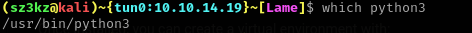

With the help of [this site](https://python.land/virtual-environments/virtualenv) I set up my virtual environment.

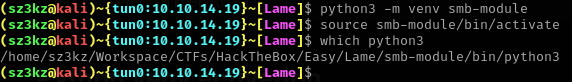

Note: In order to get out, one can do this:

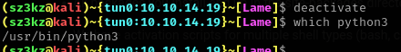

### Installing the package

I then installed the package:

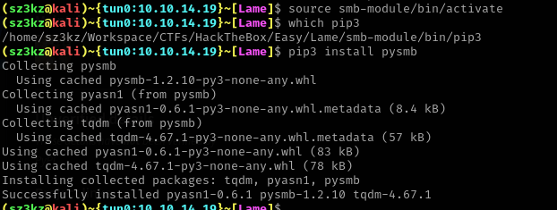

And confirmed that the exploit now runs.

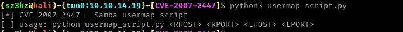

### Running the exploit

This exploit forces the target to create a reverse-shell with our machine. In order for the server to have something to connect to, we use netcat to set up a listener.

From running the exploit without arguments earlier we see the argument format we should use:
* <RHOST> - server IP ("R"emote)
* <RPORT> - server port
* <LHOST> - our machine IP ("L"istner)
* <LPORT> - port nc is listening on

Note: the <RPORT> argument should be either 139 or 445. I have tried to run it on any other port and the connection is not made. I believe it to be another sign that a firewall is specifically disallowing the server to communicate over ports other than we found in the scan.

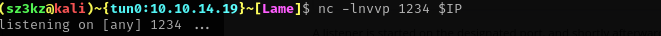

I triggered the exploit:

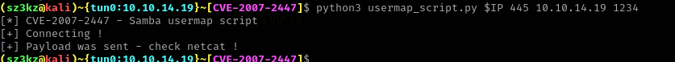

And bam! I got a reverse-shell!
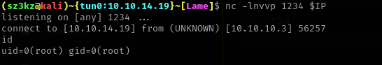

Thats it!

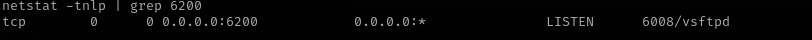
